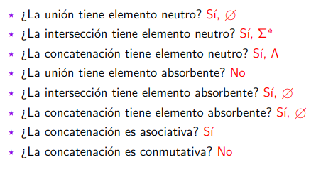
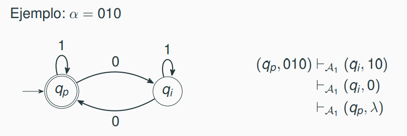
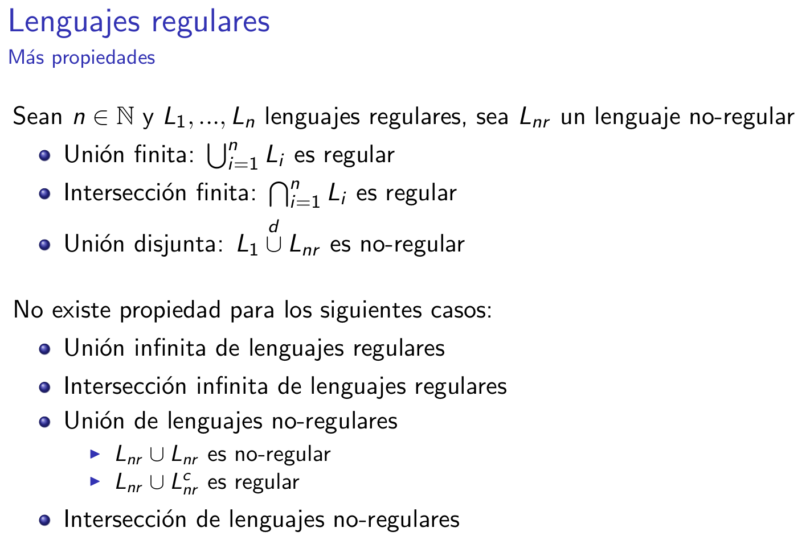
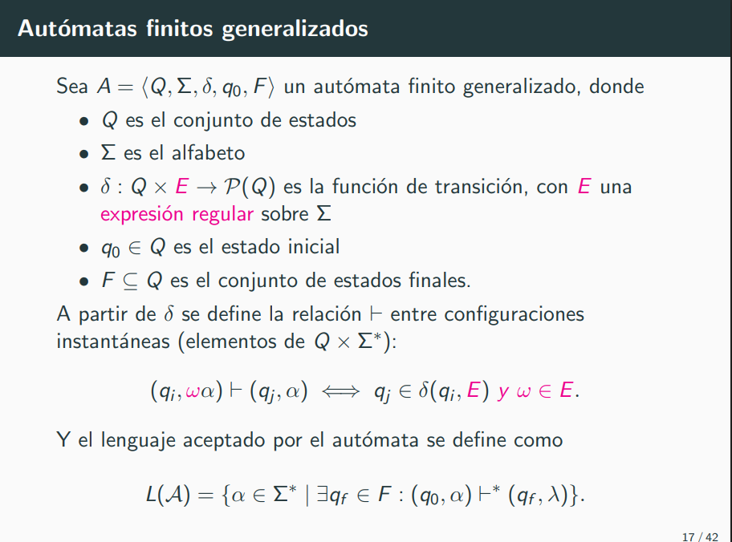
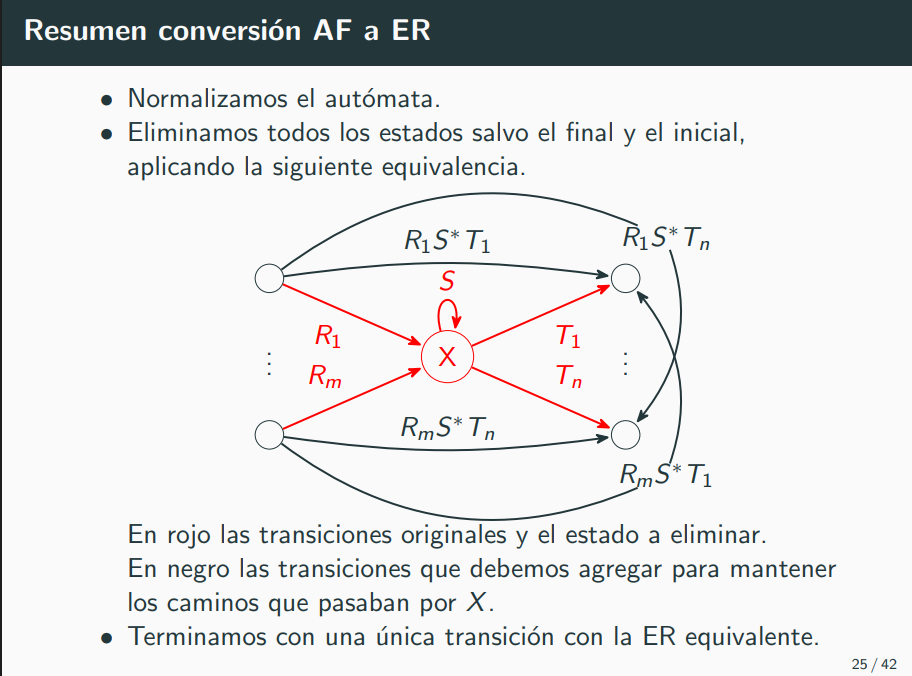
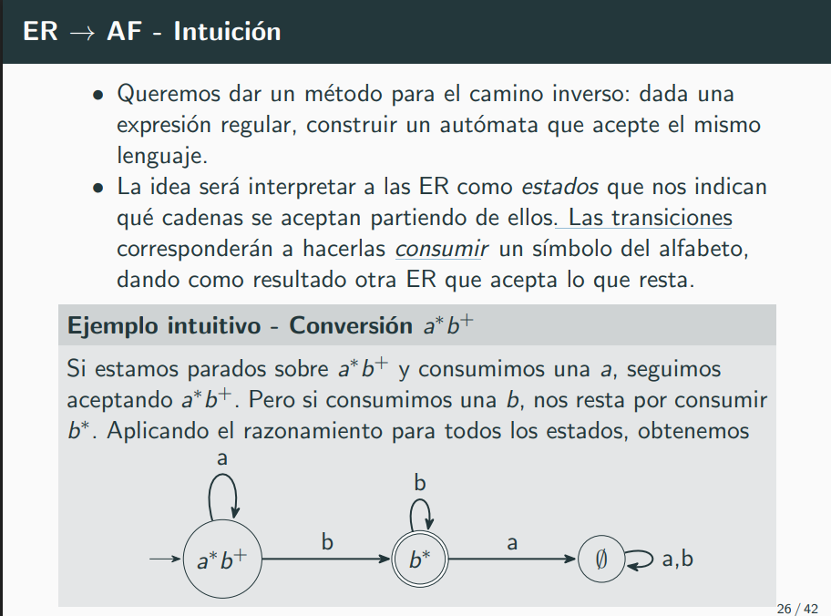
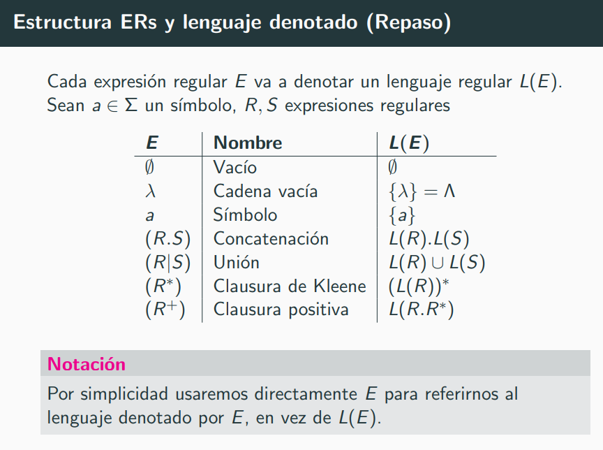
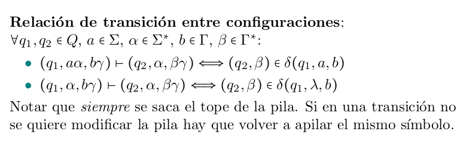
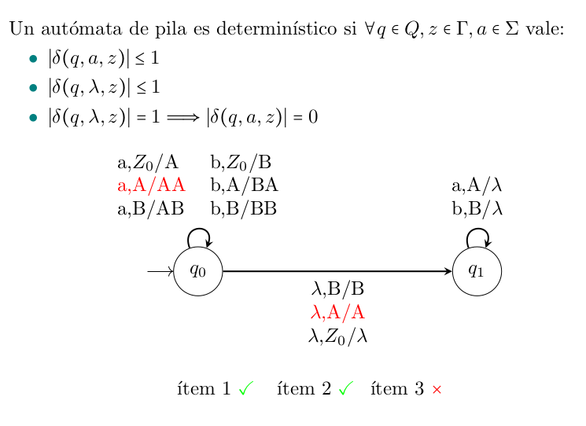
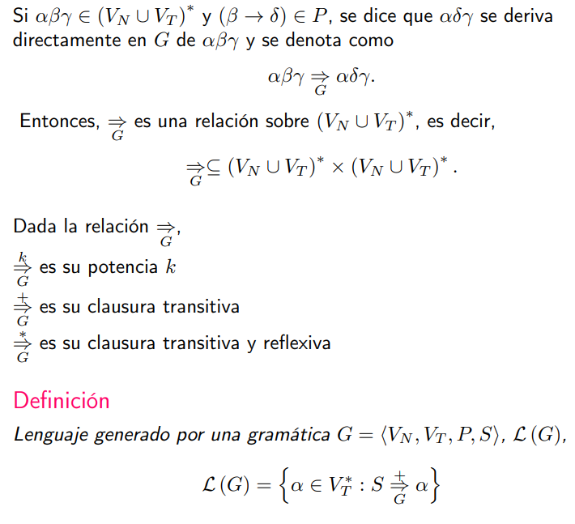

# Primer Parcial

## Temas
1. Lenguaje y Jerarquía de Chomsky
2. Lenguajes Regulares: AFD, AFND, ER
3. Lenguajes No Regulares y lema de pumping
4. Lenguajes Libres de Contexto: Autómatas de Pila y Lenguajes Determinísticos
5. Lenguajes No Libres de Contexto y lema de pumping v2

## Practica 1: Lenguajes

Un lenguaje sobre un alfabeto Σ es un conjunto (no necesariamente finito) de cadenas (finitas) sobre dicho alfabeto.

### Clausuras (de Alfabetos y de Lenguajes)

> Clausura de Kleene
$\Sigma^* = \cup_{i>=0} \Sigma^i$
$L^* = \cup_{i>=0} L^i$

> Clausura Positiva
$\Sigma^+ = \cup_{i>0} \Sigma^i$
$L^+ = \cup_{i>0} L^i$

### Operaciones y sus propiedades

> Unión 
    $L_1 \cup L_2$
    $M_1 = < Q_1, \Sigma, \delta_1, q_0, F_1 >$
    $M_2 = < Q_2, \Sigma, \delta_2, p_0, F_2 >$
    $M \text{ el autómata finito con } L(M) = L(M_1) \cup L(M_2) = L_1 \cup L_2$
    $M = < Q_3, \Sigma, \delta_3, q_3, F_3 > $
    $Q_3 = Q_1 \cup Q_2 \cup \{ I \}$
    $q_3 = I$
    $F_3 = F_1 \cup F_2$
    Y $\delta$ se mantiene igual solamente agregando transiciones $\lambda$ de I hasta los $q_0$ y $p_0$, 
    y de $I$ al trampa para completar el AF.

> Intersección
    $L_1 \cap L_2 = (L_1^c \cup L_2^c)^c$
    Para armar el autómata finito de una intersección vemos lo siguiente...
    $M_1 = < Q_1, \Sigma, \delta_1, q_0, F_1 >$
    $M_2 = < Q_2, \Sigma, \delta_2, p_0, F_2 >$
    $M \text{ el autómata finito con } L(M) = L(M_1) \cap L(M_2) = L_1 \cap L_2$
    $M = < Q_3, \Sigma, \delta_3, q_3, F_3 > $
    $Q_3 = Q_1 \times Q_2, \text{esto son tuplas (q,p) con } q\in Q_1 \land p\in Q_2$ 
    $\delta_3((q,p), a) = (\sigma_1(q,a), \sigma_2(p,a))$ 
    $q_3 = (q_0, p_0)$
    $F_3 = \{ (q,p) \in Q_3 | q\in F_1 \land p\in F_2\}$

> Complemento
    El autómata tiene que ser determinístico.
    Completamos el Autómata Finito inicial e invertimos los estados finales.

> Concatenación
    $L_1 . L_2$
    Uno nodos finales de $F_1$ con el inicial de $L_2$.

> Reverso
    $L^r$. Damos vuelta las flechas e invertimos estados finales/iniciales.

Los lenguajes regulares están cerrados por unión, intersección, complemento, concatenación y reverso.

> Potencia

> Ini(L): 
    Sacarle 0 o más simbolos al final.
    Para armar este AF, tomo el del L original y agrego estados finales en todos los no finales y paso el final a inicial.

> Fin(L): 
    Sacarle 0 o más símbolos al principio.
    Cambio q0 por un T que se conecta a todos los los estados como q_0 pero con \lambdas

> Subseq(L): 
    Sacarle 0 o más símbolos al principio o final.
    Todos los estados son finales.

> Max(L):
    Elimino todos los estados finales de cadenas aceptadas menor a la long de la max palabra aceptada.

> Mín(L):
    Elimino todos los estados finales de cadenas aceptadas mayor a la long de la menor palabra aceptada.

## Práctica 2: Autómatas Finitos

Los autómatas finitos, las ER y las Gramáticas son formalismos para especificar Lenguajes Regulares.

### Definicion

Los autómatas finitos son máquinas abstractas que nos permiten reconocer lenguajes regulares.
Existen distintos tipos:
> Autómatas Finitos Deterministicos
> Autómatas Finitos No-Deterministicos (con o sin $\lambda$)

### Configuraciones Instantáneas:
Son una tupla compuesta por el estado actual y lo que resta de consumir
de la cadena. Representan una foto del proceso de reconocimiento de una cadena en un instante dado.
Ejemplo:

Donde: 

$$(q_i, a.α) \vdash A (q_j, α) \iff δ(q_i, a) = q_j$$

### Autómatas Finítos Determinísticos
Un AFD es una tupla de la forma
$$A = < Q, \Sigma, \delta, q_0, F> $$
Donde: 
- $Q$: es un conjunto de estados
- $\Sigma$: es un alfabeto
- $\delta: Q \times \Sigma \rightarrow Q$ es una función de transición
- $q_0$ es el estado inicial
- $F \subset Q$ es el conjunto de estados finales

> Observación: Muchas veces para que el autómata quede bien definido (la función $\sigma$ completa), lo completamos con un estado trampa.

### Lenguaje aceptado

$$\alpha \in L(A) \iff \exists q_f \in F | (q_o, \alpha) \vdash_a^* (q_f, \lambda)$$

### Autómatas Finítos No Determinísticos (con o sin $\lambda$)
Un AFND-$\lambda$ es una tupla de la forma
$$A = < Q, \Sigma, \delta, q_0, F> $$
Donde: 
- $Q$: es un conjunto de estados
- $\Sigma$: es un alfabeto
- $\delta: Q \times (\Sigma \cup \lambda) \rightarrow P(Q)$ es una función de transición
- $q_0$ es el estado inicial
- $F \subset Q$ es el conjunto de estados finales

> Observación: Se suele diferenciar entre AFNDs con y sin transiciones λ (a veces llamadas ϵ), pero para nosotros va a ser lo mismo.

### Operaciones entre lenguajes usando autómatas:
> Unión: Agregar un nuevo estado inicial que se conecte a cada nodo inicial de los lenguajes
> Intersección:
> Complemento: El autómata tiene que ser determinístico. Completamos el Autómata Finito inicial e invertimos los estados finales.
> Reversa: Ejecutamos el autómata al revés. Damos vuelta las flechas e invertimos estados finales/iniciales.

## Practica 3: Determinización

### Conversión AFND $\rightarrow$ AFD
Dado un AFND, existe un AFD que reconoce el mismo lenguaje.
El algoritmo es una construcción iterativa:

1. Defino q0' := {q0}
2. Inicializo Q' = {q0'} y marco q0' como no visitado
3. Mientras exista T en Q' con T no visitado:
    - Marcar T como visitado
    - Para cada simbolo $a \in \Sigma$:
    --  $u = mover(T,a)$
    --  Si $u \neq Q'$:
        -- |-> Agrego $u$ a $Q'$ como no visitado.
    - Defino $\delta'(T,a)=u$

Donde $mover(t,a) : P(Q) \times \Sigma \rightarrow P(Q)$ y se define...
$mover(T,a) = \cup_{t \in T} \delta(t, a) = \text{ "Lista de estados a los que llego desde cada t en T consumiendo a" }$

Los estados finales nuevos son $F' = \{ q \in Q' | q \cap F \neq \empty \}$

### Conversión AFND- $\lambda \rightarrow$ AFD
Dado un AFND-$\lambda$, existe un AFD que reconoce el mismo lenguaje.
El algoritmo es una construcción iterativa:

1. Defino q0' := {q0}
2. Inicializo Q' = {q0'} y marco q0' como no visitado
3. Mientras exista T en Q' con T no visitado:
    - Marcar T como visitado
    - Para cada simbolo $a \in \Sigma$:
    --  $u = Cl_\lambda(\cup_{t \in T}\delta(t, a))$
    --  Si $u \neq Q'$:
        -- |-> Agrego $u$ a $Q'$ como no visitado.
    - Defino $\delta'(T,a)=u$

Donde $Cl_\lambda(t,a) : P(Q) \rightarrow P(Q)$ y se define...
$$Cl_\lambda(K) = \{ r \in Q: \exists p\in K, (p,\lambda) \vdash^* (r, \lambda) \} = \text{"Lista de estados a los que llego desde los estados k in K consumiendo solo lambdas"}$$

## Práctica 4: Lema Pumping

### Lema Pumping (1)
> Si $L$ es regular entonces $L$ cumple pumping.
> Por contrarrecíproco:
    Si $L$ no cumple pumping entonces $L$ no es regular.

Sea $L$ un lenguaje regular. 
Existe entonces una longitud mínima $p$ tal que todas las cadenas $\alpha \in L$ que superan o igualan dicha longitud, pueden ser escritas como $\alpha=xyz$ donde:
$$|xy| \leq p \land |y| \geq 1$$
Y vale que $\forall i\geq0 xy^iz \in L$

#### Forma de aplicarlo:
1. Me dan un $p > 0$.
2. Elijo un $\alpha \in L$ con $|\alpha| \geq p$.
3. Vemos todas las descomposiciones $\alpha=xyz$ y validamos que alguna cumpla que $xy^iz \in L$ eligiendo $i$ a conveniencia. 

### Propiedades

## Práctica 5: Expresiones Regulares

### Expresiones Regulares
Dado un alfabeto $\Sigma$ una expresion regular denota un lenguaje sobre $\Sigma$.
Están definidas inductivamente:
- $\empty$ es la ER que denota al conjunto vacio
- $\lambda$ es la ER denota {$\lambda $}
- $\forall a \in \Sigma, a$ es la ER que denota {$a$}
- Si $r$ y $s$ son dos ER que denotan dos lenguajes $R$ y $S$:
    -- $r | s$ denota $R \cup S$
    -- $rs$ denota $RS$
    -- $r^*$ denota $R^*$
    -- $r^+$ denota $R^+$

Teorema: Dada una ER existe un AFND-$\lambda$ con un solo estado final y sin transiciones a partir del mismo que reconoce el mismo lenguaje.

Teorema: Dado un AFND M, existe una ER r tal que L(M)=L(r)

### Precedencia de operadores
La precedencia es *, ., | (es decir, * se aplica antes que . y . que |).

### Propiedades

La union y la concatenacion son asociativas...
> (R|S)|T = R|(S|T) = R|S|T
> (R.S).T = R.(S.T) = R.S.R

Conmutatividad de la union
> R|S = S|R

Distributividad de la concatenacion respecto de la union
> R(S|T) = RS | RT
> (R|S)T = RT | ST

Elemento neutro para la concatenacion
> $R.\lambda = \lambda.R = R$

Elemento absorbente para la concatenacion
> $R.\empty = \empty.R = \empty$

Elemento neutro para la union:
> $R|\empty = \empty | R = R$

### Conversión Autómata Finito a Expresion Regular

Definimos un AF especial para hacer el pasaje.

#### Algoritmo:
1. Normalizamos el Autómata. Esto es que tenga un único estado final sin transiciones salientes. Además el estado inicial no debe tener transiciones entrantes ni ser final. Para esto:
-> Agregamos un nuevo estado uinicial con una sola transicion $\lambda$ al estado inicial original.
-> Agregamos un nuevo estado final con transiciones $\lambda$ desde los estados finales originales (que dejan de ser finales).
2. Eliminamos estados manteniendo el lenguaje aceptado, poniendo en las aristas todas las posibles cadenas que se forman.
3. Los estados finales son los $E_i$ tal que $\lambda \in E_i$

### Conversión Expresion Regular a Autómata Finito
2

#### Algoritmo
Parto de la ER original $E_0$ y para cada simbolo $a\in\Sigma$ calculo $\partial_a(E_0) = E_1$.
Para todos los $E_i$ nuevos que aparezcan en el proceso calculo $\forall a\in\Sigma, \partial_a(E_i)$ hasta que no aparezcan nuevos $E_i$.
Armo un AF usando todos los $E_i$ como nodos y $\sigma(a, E_i) = \partial_a(E_i)$

#### Cociente de un Lenguaje
Sea $L$ un lenguaje sobre un alfabeto $\Sigma$, $a \in \Sigma$:
$$a⁻1(L) = \{ \alpha | \alpha \in \Sigma^* \text{ que cumplen } a\alpha \in L \}$$
Por ejemplo: $L={abc,cbe,a} \land \Sigma={a,b,c}$ entonces $c^{-1}(L) = \{be\}$

#### Derivadas para una Expresion Regular (R)

$$\partial a(R) = \text{"A qué ER transiciona luego de consumir el símbolo a"}$$
Se define con inducción estructural (sean R, S dos ER):

$\partial_a(\empty) = \empty$
$\partial_a(\lambda) = \empty$
$\partial_a(b) = 
    \begin{cases} 
    \lambda & \text{si a=b} \\ 
    \empty & \text{cc}
    \end{cases}$    
$\partial_a(R|S) = \partial_a(R) | \partial_a(S)$
$\partial_a(R.S) = 
    \begin{cases}
    \partial_a(R).S & \text{ si }\lambda \notin R \\
    \partial_a(R).S | \partial_a(S) & \text{ si }\lambda \in R \\
    \end{cases}$
$\partial_a(R^*)=\lambda_a(R).R^*$
$\partial_a(R^+)=\lambda_a(R.R^*) = \partial_a(R).R^*$

## Práctica 6: Autómatas de Pila y Gramáticas

Los lenguajes libres del contexto (nivel 2 en Jerarquia de Chomsky), tienen mayor poder expresivo que los lenguajes regulares. Estos pueden ser formalizados mediante Autómatas de pilas y Gramáticas libres de ctx.

### Autómata de Pila
Se define como una 7-upla 
$$M = < Q, \Sigma, \Gamma, \delta, q_0, Z_0, F >$$

Siendo:
> $\Gamma$: El alfabeto de la pila
> $Z_0 \in \Gamma$: El símbolo inicial de la pila
> $\delta$: La funcion de transición con tipo $\sigma: Q \times (\Sigma \cup \{ \lambda \}) \times \Gamma \rightarrow P(Q\times \Gamma^*)$
> $Q$: Conjunto finito de estados
> $\Sigma$: Alfabeto de entrada
> $q_0 \in Q$: Estado inicial

Las transiciones se definen como:
$$ \text{simboloEntrada}, \text{simboloTopePilaQueDesapilo} / \text{cadenaQueApilo}$$

Configuraciones instantáneas:
$$(q, \alpha, \gamma) \in Q \times \Sigma^* \times \Gamma^*$$

Relacion de transición entre configuraciones:

Lenguaje aceptado:
$$\alpha \in L(M) \iff \exists q_f \in F, \gamma \in \Gamma^* | (q_0, \alpha, Z_0) \vdash^* (q_f, \lambda, \gamma)$$

Autómata de pila determinístico:

### Lema de Pumping para Lenguajes Libres de Contexto

Para todo lenguaje $L$ libre de contexto, existe $n>0$ tal que para toda cadena $\alpha \in L$ con $|\alpha| \geq n$,
- Existe una descomposición de $\alpha$ en cadenas $r, x, y, z, s$ es decir $\alpha=rxyzs$.
- $|xyz| \leq n$
- $|xz| \geq 1$
- $\forall i \geq 0, rx^iyz^is \in L$

### Propiedades
> Los lenguajes generados por APND tienen mayor poder expresivo que los APD
> Los lenguajes generados por APND por estado final tienen el mismo poder expresivo que los APND por pila vacia
> Los lenguajes generados por PAD por estado final tienen mayor poder expresivo que los APD por pila vacia
> Los lenguajes generados por APD por pila vacia son libres de prefijos

### Gramática
Una gramática es una 4-upla $G = < V_N, V_T, P, S >$ donde:
> $V_N$ es el conjunto de simbolos no-terminales (variables/categorías sintácticas)
> $V_T$ es un conjunto de símbolos terminales 
> $P$ es el conjunto de producciones 
> $S \in V_N$ es el símbolo distinguido (start) de $V_N$

En la jerarquía de Chomsky hay 4 tipos de gramática:
> Tipo 0 (gramáticas sin restricciones): $\alpha \rightarrow \beta$
> Tipo 1 (gramáticas sensibles al contexto): $\alpha \rightarrow \beta, |\alpha| \leq |\beta|$
> Tipo 2 (gramáticas libres de contexto): $\alpha \rightarrow \gamma, A\in V_N, \gamma \in (V_N \cup V_T)*$
> Tipo 3 (gramáticas regulares): $A \rightarrow a, A \rightarrow aB, A \rightarrow \lambda, \text{ con A, B } \in V_N, a\in V_T$

### Importancia de las gramáticas libres de contexto: 
Para cada gramática libre de contexto G hay un autómata de pila M que acepta el lenguaje generado por dicha gramática y viceversa.
Dada una gramática libre de contexto G, se puede decidir si una palabra pertenece a L(G) en tiempo del orden cúbico de la longitud de la palabra.
En casos especiales (determinismo), se puede reconocer en tiempo lineal.
Los lenguajes de programación son lenguajes libres de contexto.

